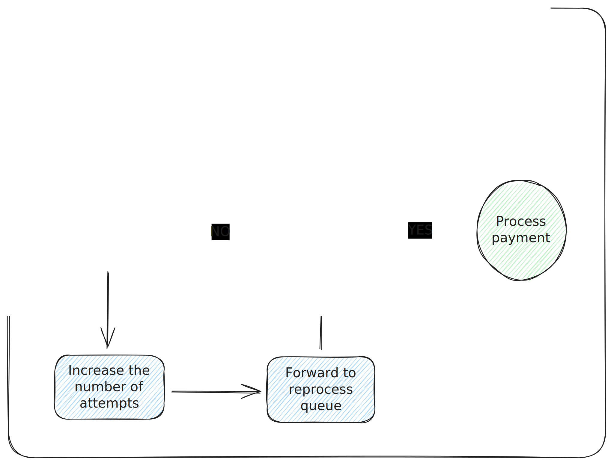

# Race condition em sistemas distribuídos

## Cenário:

Temos um serviço de pagamento que consome dados de duas filas:

- `clients-processor`: fila com dados de clientes para cadastrar
- `payment-processor`: fila com dados de um pagamento para ser processado

Esse serviço processa os pagamentos, porém ele só processa pagamentos de clientes que estão cadastrados.

## Problema:

Como tratar o problema de race condition quando um evento de pagamento é recebido primeiro que o evento de cadastro de clientes (sem utilizar bancos de dados). Para simplificar mais temos a premissa que o evento de cadastro de cliente sempre será recebido.

## A solução:

- Uma fila para evento de cadastro de clientes: `clients-processor`
- Uma fila para evento de pagamentos: `payment-processor`
- Uma fila para reprocessar eventos de pagamentos: `payment-reprocessor` utilizando o plugin [`delayed_message_exchange`](https://github.com/rabbitmq/rabbitmq-delayed-message-exchange/releases) do RabbitMQ

Quando um evento de pagamento é recebido e o cliente ainda não está cadastrado, aumentamos o valor do `delay` da mensagem em `1 segundo`. A mensagem é então encaminhada para a fila de reprocessamento. Em algum momento, quando um cliente for efetivamente cadastrado, o pagamento correspondente será processado.

Para exemplificar melhor, o fluxo grama abaixo mostra a abordagem utilizada:



## Como executar:

O [docker-compose](./docker-compose.yml) é configurado para executar o **RabbitMQ**, carregando o plugin necessário que está presente na pasta `rabbitmq/plugins` na raiz do projeto.

Para rodar o **RabbitMQ** execute:

```sh
$ docker-compose up
```

Execute o comando abaixo para começar a consumir as mensagens das filas de `clients-processor`, `payment-processor` e `payment-reprocessor`.

```sh
$ go run ./cmd/consumer
```

Agora basta publicar as mensagens:

```sh
$ go run ./cmd/producer payment <clientId>
```

> Para publicar uma mensagem de pagamento para o cliente de **clientId** informado

```sh
$ go run ./cmd/producer client <clientId>
```

> Para publicar uma mensagem de cadastro para o cliente com **clientId** informado

## Exemplo:

Para o exemplo, vamos enviar duas mensagens, uma com o pagamento e outra com o novo cliente.

Ao receber um pagamento de um cliente com o **ID 1**, o pagamento não vai ser processado, a mensagem é enviada para uma fila e o delay vai aumentando, até que a mensagem de cadastro do cliente é recebida, no proximo recebimento do pagamento ele será processado e a operação finaliza.
